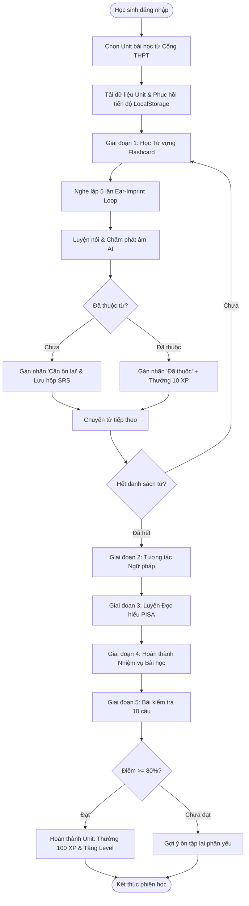
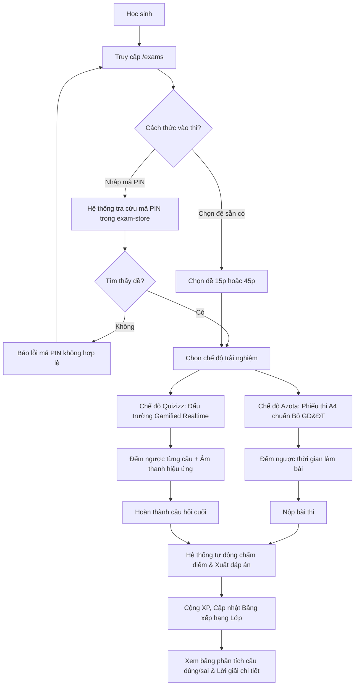

# CƠ SỞ LÝ THUYẾT & KIẾN TRÚC KỸ THUẬT HỆ THỐNG LINGOQUEST
## Nền Tảng Học Tập & Khảo Thí Tiếng Anh THPT Tương Tác Thích Ứng Bám Sát Chương Trình GDPT 2018

> **Bản đầy đủ có thể xem tại:** [`docs/CO_SO_LY_THUYET_LINGOQUEST.md`](docs/CO_SO_LY_THUYET_LINGOQUEST.md)

---

## MỤC LỤC TỔNG QUAN

1. [TỔNG QUAN ĐỀ TÀI & BỐI CẢNH NGHIÊN CỨU](#1-tổng-quan-đề-tài--bối-cảnh-nghiên-cứu)
   - 1.1. Tên đề tài & Định danh hệ thống
   - 1.2. Tính cấp thiết & Bối cảnh đổi mới giáo dục THPT (GDPT 2018)
   - 1.3. Mục tiêu nghiên cứu & Phạm vi ứng dụng
2. [CƠ SỞ LÝ LUẬN GIÁO DỤC & PHƯƠNG PHÁP LUẬN SƯ PHẠM](#2-cơ-sở-lý-luận-giáo-dục--phương-pháp-luận-sư-phạm)
   - 2.1. Thuyết Kiến tạo Xã hội (Social Constructivism) & Vùng phát triển gần (ZPD)
   - 2.2. Đường hướng Dạy học Ngôn ngữ Giao tiếp (CLT) & Dạy học theo Nhiệm vụ (TBLT)
   - 2.3. Thuyết Mã hóa Kép (Dual-Coding Theory) & Khắc sâu Âm thanh (Ear-Imprint Loop)
   - 2.4. Hệ thống Lặp lại Ngắt quãng (Spaced Repetition System - SRS) & Đường cong Quên lãng
   - 2.5. Khung Lý thuyết Trò chơi hóa trong Giáo dục (Gamification & Octalysis Framework)
   - 2.6. Khung Đo lường & Đánh giá Năng lực (Assessment Framework: Formative vs. Summative)
3. [CƠ SỞ KHOA HỌC DỮ LIỆU & NỘI DUNG CHƯƠNG TRÌNH](#3-cơ-sở-khoa-học-dữ-liệu--nội-dung-chương-trình)
   - 3.1. Chuẩn đầu ra CEFR & Khung chương trình THPT Quốc gia
   - 3.2. Cấu trúc học liệu Sách giáo khoa Global Success Lớp 11
   - 3.3. Chuẩn hóa Ngân hàng Đề thi & Cơ chế Truy cập qua Mã PIN (PIN-based Resolution)
4. [KIẾN TRÚC HỆ THỐNG & CƠ SỞ KỸ THUẬT CÔNG NGHỆ](#4-kiến-trúc-hệ-thống--cơ-sở-kỹ-thuật-công-nghệ)
   - 4.1. Mô hình Kiến trúc Phần mềm 3 Tầng (3-Tier Modern Architecture)
   - 4.2. Công nghệ Giao diện & Kỹ thuật Tối ưu Trải nghiệm (Frontend & UX Engineering)
   - 4.3. Công nghệ Xử lý Âm thanh & Nhận dạng Giọng nói (Web Speech API)
   - 4.4. Cơ chế Đồng bộ Trạng thái 2 Chiều & Lưu trữ Phiên học
   - 4.5. Cơ chế Kiểm soát Quyền truy cập theo Vai trò (RBAC)
5. [PHÂN TÍCH CHI TIẾT CÁC PHÂN HỆ CHỨC NĂNG](#5-phân-tích-chi-tiết-các-phân-hệ-chức-năng)
   - 5.1. Phân hệ Cổng Chương trình THPT (Curriculum Hub)
   - 5.2. Phân hệ Phòng học Tương tác Đa phương thức (Interactive Unit Studio)
   - 5.3. Phân hệ Đấu trường Khảo thí Trực tuyến (Exam Arena: Azota vs. Quizizz)
   - 5.4. Phân hệ Quản trị Giảng dạy & Trợ lý Chấm bài AI (Teacher Studio & AI Grader)
   - 5.5. Động cơ Trò chơi hóa & Thúc đẩy Động lực (Gamification Engine)
6. [MÔ HÌNH HÓA QUY TRÌNH & BIỂU ĐỒ HOẠT ĐỘNG (FLOWCHARTS)](#6-mô-hình-hóa-quy-trình--biểu-đồ-hoạt-động-flowcharts)
   - 6.1. Sơ đồ Luồng Học tập Thích ứng (Adaptive Learning Loop)
   - 6.2. Sơ đồ Luồng Khảo thí Trực tuyến (Dual-Mode Assessment Flow)
7. [KẾT LUẬN & HƯỚNG PHÁT TRIỂN](#7-kết-luận--hướng-phát-triển)
8. [TÀI LIỆU THAM KHẢO](#8-tài-liệu-tham-khảo)

---

## 1. TỔNG QUAN ĐỀ TÀI & BỐI CẢNH NGHIÊN CỨU

### 1.1. Tên Đề Tài & Định Danh Hệ Thống
- **Tên tiếng Việt:** *Nghiên cứu, Thiết kế và Xây dựng Nền tảng EdTech Học tập & Khảo thí Tiếng Anh THPT Tương tác Thích ứng LingoQuest.*
- **Tên tiếng Anh:** *LingoQuest: An Interactive & Adaptive EdTech Platform for High School English Learning and Standardized Assessment.*
- **Phân loại sản phẩm:** Ứng dụng Web Giáo dục Đa phương thức (Multimodal Educational Web Application), kết hợp Khảo thí Trực tuyến (Computer-Based Assessment) và Trí tuệ Nhân tạo Hỗ trợ Giảng dạy (AI-Assisted Tutoring).

### 1.2. Tính Cấp Thiết & Bối Cảnh Đổi Mới Giáo Dục THPT (GDPT 2018)
1. **Chuyển dịch trọng tâm giáo dục:** Theo Thông tư 32/2018/TT-BGDĐT của Bộ Giáo dục và Đào tạo ban hành Chương trình Giáo dục phổ thông mới (GDPT 2018), môn Tiếng Anh đã chuyển dịch căn bản từ việc "truyền thụ kiến thức ngôn ngữ ngữ pháp thụ động" sang "phát triển phẩm chất và năng lực giao tiếp thực tế" đạt chuẩn B1/B2 theo Khung tham chiếu Châu Âu (CEFR).
2. **Khó khăn thực tế của học sinh THPT:**
   - Học sinh thường đối mặt với sách giáo khoa và tài liệu ôn thi khô khan, mang nặng tính tĩnh (static text), thiếu tính sinh động và tương tác.
   - Hiện tượng **"Học trước quên sau"** (đặc trưng bởi Đường cong Quên lãng Ebbinghaus) diễn ra phổ biến khi học sinh cố ghi nhớ từ vựng đơn lẻ mà không có ngữ cảnh, cụm từ cố định (collocations) hoặc âm thanh chuẩn xác.
   - Thiếu môi trường phản xạ ngữ âm (pronunciation feedback) thường xuyên do thời lượng tiết học trên lớp (45 phút/tiết cho 40-45 học sinh) không đủ để giáo viên sửa lỗi phát âm từng cá nhân.
3. **Thách thức của giáo viên trong kỷ nguyên chuyển đổi số:**
   - Việc biên soạn đề kiểm tra 15 phút, 45 phút, đề giữa kỳ theo định dạng mới (kỳ thi tốt nghiệp THPT từ năm 2025) tiêu tốn rất nhiều thời gian.
   - Chấm bài tập tự luận (viết đoạn văn, luận ngắn) đòi hỏi tính nhất quán theo barem chuẩn (Rubric), thường bị quá tải khi phải chấm hàng trăm bài mỗi tuần.
   - Nhu cầu cấp bách về một hệ thống hợp nhất: Vừa cho phép học sinh tự học vừa giúp giáo viên giao bài, tổ chức thi trắc nghiệm (chuẩn phiếu A4 Azota hoặc đấu trường game Quizizz) và theo dõi tiến độ chi tiết.

### 1.3. Mục Tiêu Nghiên Cứu & Phạm Vi Ứng Dụng
- **Mục tiêu tổng quát:** Xây dựng một nền tảng EdTech toàn diện, tối ưu hóa trải nghiệm người dùng (UX), tích hợp các nguyên lý sư phạm hiện đại nhằm nâng cao hiệu quả tiếp thu kiến thức Tiếng Anh THPT và tối ưu hóa quy trình khảo thí.
- **Phạm vi nội dung:** Toàn bộ chương trình Tiếng Anh THPT (Lớp 10, 11, 12), tập trung triển khai chuyên sâu hệ thống học liệu Tiếng Anh 11 Global Success (10 Units + 4 Bài ôn tập hoàn chỉnh).
- **Phạm vi người dùng:** Phân quyền rạch ròi 2 đối tượng: Học sinh (Student) và Giáo viên (Teacher).

---

## 2. CƠ SỞ LÝ LUẬN GIÁO DỤC & PHƯƠNG PHÁP LUẬN SƯ PHẠM

Nền tảng LingoQuest không đơn thuần là một hệ thống số hóa văn bản, mà được thiết kế dựa trên các lý thuyết khoa học giáo dục và tâm lý học nhận thức vững chắc.

```
       ┌─────────────────────────────────────────────────────────────┐
       │             NỀN TẢNG SƯ PHẠM CỦA LINGOQUEST                 │
       └──────────────────────────────┬──────────────────────────────┘
                                      │
         ┌────────────────────────────┼────────────────────────────┐
         │                            │                            │
         ▼                            ▼                            ▼
┌──────────────────┐        ┌──────────────────┐        ┌──────────────────┐
│  Thuyết Kiến Tạo │        │ Thuyết Mã Hóa Kép│        │  Hệ Thống Lặp Lại│
│  & Vùng ZPD      │        │  (Dual-Coding)   │        │   Ngắt Quãng     │
│ (Vygotsky, 1978) │        │ (Paivio, 1986)   │        │ (Ebbinghaus, SRS)│
└──────────────────┘        └──────────────────┘        └──────────────────┘
         │                            │                            │
         ▼                            ▼                            ▼
┌──────────────────┐        ┌──────────────────┐        ┌──────────────────┐
│  Dạy Ngôn Ngữ    │        │  Trò Chơi Hóa    │        │  Đánh Giá Đa Dạng│
│  Giao Tiếp (CLT) │        │   (Gamification) │        │  (Formative vs.  │
│  & Nhiệm Vụ TBLT │        │(Octalysis, 2015) │        │    Summative)    │
└──────────────────┘        └──────────────────┘        └──────────────────┘
```

### 2.1. Thuyết Kiến Tạo Xã Hội (Social Constructivism) & Vùng Phát Triển Gần (ZPD)
- **Cơ sở lý thuyết:** Theo Lev Vygotsky (1978), tri thức không thể truyền đạt thụ động mà phải được người học chủ động kiến tạo thông qua tương tác. Vygotsky định nghĩa **Vùng phát triển gần (Zone of Proximal Development - ZPD)** là khoảng cách giữa mức độ phát triển hiện tại (những gì người học tự làm được) và mức độ phát triển tiềm năng (những gì người học có thể làm được với sự hướng dẫn của chuyên gia hoặc công cụ trợ giúp).
- **Ứng dụng trong LingoQuest (Instructional Scaffolding):**
  - Hệ thống "Giàn giáo tri thức": Học sinh không bị đưa ngay vào làm bài kiểm tra khó. Quy trình được phân tầng bậc thang:
    1. Tiếp cận từ vựng kèm phát âm và câu ví dụ minh họa ngữ cảnh.
    2. Cung cấp cụm từ hay gặp (**Collocations**) để hình thành phản xạ kết hợp từ tự nhiên.
    3. Trợ lý AI nhận diện phát âm hỗ trợ chỉnh sửa ngữ âm tức thời.
    4. Thử thách tương tác tại Interactive Grammar Studio và Reading Studio.
    5. Kiểm tra đánh giá 10 câu trắc nghiệm đa tầng có giải thích chi tiết.

### 2.2. Đường Hướng Dạy Học Ngôn Ngữ Giao Tiếp (CLT) & Dạy Học Theo Nhiệm Vụ (TBLT)
- **Cơ sở lý thuyết:** Đường hướng CLT (Communicative Language Teaching) và TBLT (Task-Based Language Teaching - Ellis, 2003) nhấn mạnh việc học ngôn ngữ thông qua thực hiện các nhiệm vụ có ý nghĩa thực tế (meaningful tasks) thay vì học vẹt các cấu trúc câu cô lập.
- **Ứng dụng trong LingoQuest:**
  - Mỗi bài học (Unit) xoay quanh một chủ đề thực tiễn của cuộc sống (Health & Lifestyle, Generation Gap, Cities of the Future, ASEAN...).
  - Học sinh không học ngữ pháp dưới dạng công thức khô khan, mà được phân tích theo 3 bình diện: *Hình thức (Form) - Ý nghĩa (Meaning) - Cách dùng (Use)*.
  - Interactive Quest Board biến bài tập thành chuỗi nhiệm vụ giải quyết vấn đề thực tế (Problem-solving tasks).

### 2.3. Thuyết Mã Hóa Kép (Dual-Coding Theory) & Khắc Sâu Âm Thanh (Ear-Imprint Loop)
- **Cơ sở lý thuyết:** Allan Paivio (1986) chứng minh rằng não bộ con người xử lý thông tin qua hai hệ thống độc lập nhưng tương hỗ: **Hệ thống Ngôn ngữ (Verbal System - văn bản, ký tự, ngữ nghĩa)** và **Hệ thống Phi ngôn ngữ (Non-verbal System - hình ảnh, âm thanh, biểu tượng)**. Khi thông tin được mã hóa đồng thời trên cả hai kênh, khả năng lưu giữ và truy xuất trí nhớ dài hạn (Long-term memory) tăng gấp nhiều lần.
- **Ứng dụng trong LingoQuest:**
  - Thẻ Flashcard tích hợp đồng thời: Chữ viết (Word), Phiên âm chuẩn quốc tế (IPA), Nghĩa tiếng Việt, Câu ví dụ ngữ cảnh, và Âm thanh phát âm bản ngữ.
  - **Tính năng độc quyền "Khắc sâu Âm thanh (Ear-Imprint Loop)":** Tự động phát lặp lại từ vựng 5 lần với quãng nghỉ 800ms giữa các lần. Cơ chế này kích hoạt **Vòng lặp âm vị học (Phonological Loop)** trong Trí nhớ làm việc (Working Memory - Baddeley & Hitch), giúp học sinh "in hằn" trường âm thanh của từ trước khi thực hành nói.

### 2.4. Hệ Thống Lặp Lại Ngắt Quãng (Spaced Repetition System - SRS) & Đường Cong Quên Lãng
- **Cơ sở lý thuyết:** Hermann Ebbinghaus (1885) đã chứng minh rằng con người sẽ quên khoảng 70% lượng thông tin mới học sau 24-48 giờ nếu không được ôn tập. Thuật toán Spaced Repetition (nổi tiếng qua hệ thống hộp Leitner và SuperMemo SM-2 của Piotr Wozniak) chứng minh rằng: Việc ôn tập ngắt quãng đúng vào thời điểm chuẩn bị quên sẽ củng cố "dấu vết trí nhớ" (memory trace), biến trí nhớ ngắn hạn thành trí nhớ vĩnh viễn.
- **Ứng dụng trong LingoQuest:**
  - Hệ thống theo dõi trạng thái của từng từ vựng theo 3 cấp độ:
    - `new`: Từ mới chưa học.
    - `learning`: Đang ghi nhớ, cần ôn tập thường xuyên.
    - `mastered`: Đã thuộc hoàn toàn (được bảo chứng bằng nhận diện giọng nói hoặc hoàn thành chuỗi flashcard).
  - Thuật toán tự động đẩy các từ ở trạng thái `learning` lên ưu tiên học trước trong các phiên làm việc tiếp theo.
  - Nút bấm *"Cần ôn lại thêm (Phím 1)"* và *"Đã thuộc từ này (+10 XP - Phím 2)"* giúp học sinh tự chủ điều tiết nhịp độ ghi nhớ.

### 2.5. Khung Lý Thuyết Trò Chơi Hóa Trong Giáo Dục (Gamification & Octalysis Framework)
- **Cơ sở lý thuyết:** Trò chơi hóa (Deterding et al., 2011) là việc ứng dụng các cơ chế trò chơi vào bối cảnh phi trò chơi. Khung Octalysis của Yu-kai Chou (2015) xác định 8 động lực cốt lõi chi phối hành vi con người, đặc biệt là *Cảm giác tiến bộ & Thành tựu (Accomplishment)*, *Ý thức xã hội & Thi đua (Social Influence)*, và *Sự làm chủ (Empowerment)*.
- **Ứng dụng trong LingoQuest:**
  - **Điểm kinh nghiệm (XP):** Thưởng điểm tức thì cho mỗi hành động tích cực (+10 XP khi thuộc từ, +100 XP khi hoàn thành Unit, +50 XP khi đạt điểm kiểm tra cao).
  - **Chuỗi ngày học tập (Daily Streak):** Thúc đẩy thói quen học tập vi mô (Micro-learning) hàng ngày để duy trì ngọn lửa chuỗi học.
  - **Cấp độ (Leveling):** Tăng cấp dần khi tích lũy đủ XP, đem lại cảm giác tự hào và thăng tiến rõ rệt.
  - **Bảng xếp hạng lớp học (Leaderboard):** Khơi dậy tinh thần thi đua lành mạnh giữa các bạn học trong lớp.
  - **Nhiệm vụ hàng ngày (Daily Quests):** Đặt ra các mục tiêu rõ ràng, định lượng (Học 5 từ mới, làm 1 bài kiểm tra, phát âm đạt điểm cao).

### 2.6. Khung Đo Lường & Đánh Giá Năng Lực (Assessment Framework)
LingoQuest tích hợp đồng thời hai hình thức đánh giá theo chuẩn kiểm tra hiện đại:
1. **Đánh giá Quá trình (Formative Assessment):**
   - Đóng vai trò là công cụ hỗ trợ học tập (*Assessment for Learning*).
   - Bao gồm kiểm tra ngữ âm tức thời (Speech AI Pronunciation Checker), câu hỏi trắc nghiệm sau mỗi thẻ từ, và bài kiểm tra 10 câu cuối Unit có phân tích phản hồi chi tiết cho từng phương án sai.
2. **Đánh giá Tổng kết (Summative Assessment):**
   - Đóng vai trò đo lường năng lực đầu ra (*Assessment of Learning*).
   - Tích hợp 2 chế độ thi đấu:
     - **Chế độ Azota (Phiếu thi chuẩn hóa A4):** Mô phỏng 100% định dạng đề thi thử THPT Quốc gia, kiểm soát thời gian làm bài, giao diện nghiêm túc, có phiếu tô trắc nghiệm.
     - **Chế độ Quizizz Arena (Đấu trường thi đấu thời gian thực):** Đề thi tính giờ theo từng câu hỏi, tính điểm dựa trên tốc độ và độ chính xác, hiệu ứng âm thanh sống động và bảng xếp hạng realtime.

---

## 3. CƠ SỞ KHOA HỌC DỮ LIỆU & NỘI DUNG CHƯƠNG TRÌNH

### 3.1. Chuẩn Đầu Ra CEFR & Khung Chương Trình THPT Quốc Gia
Nội dung học liệu trong LingoQuest được ánh xạ trực tiếp theo Khung tham chiếu trình độ ngôn ngữ chung Châu Âu (CEFR) và yêu cầu cần đạt của Bộ GD&ĐT:
- **Khối 10 (Lớp 10):** Cấp độ CEFR A2+ đến B1. Trọng tâm: Nền tảng cấu trúc ngữ pháp cơ bản, phát triển vốn từ vựng học đường và môi trường xung quanh.
- **Khối 11 (Lớp 11):** Cấp độ CEFR B1 đến B1+. Trọng tâm: Mở rộng từ vựng học thuật, các hiện tượng ngữ pháp phức hợp (Past Simple vs. Present Perfect, Stative Verbs in Continuous, Modal Verbs of Obligation & Advice, Linking Words, Cleft Sentences...).
- **Khối 12 (Lớp 12):** Cấp độ CEFR B1+ đến B2. Trọng tâm: Chuẩn bị thi Tốt nghiệp THPT và Đánh giá năng lực, đọc hiểu văn bản chuyên sâu, mệnh đề quan hệ rút gọn, câu bị động nâng cao.

### 3.2. Cấu Trúc Học Liệu Sách Giáo Khoa Global Success Lớp 11
Cơ sở dữ liệu của Lớp 11 được thiết kế với độ chi tiết cao, gồm 10 Units bám sát SGK Giáo dục Việt Nam:

| Unit | Tên Tiếng Anh | Tên Tiếng Việt | Chủ đề (Topic) | Ngữ pháp cốt lõi | Cấp độ |
| :---: | :--- | :--- | :--- | :--- | :---: |
| **01** | A Long and Healthy Life | Một cuộc sống dài và khỏe mạnh | Sức khỏe & Lối sống | Quá khứ đơn vs. Hiện tại hoàn thành | B1 |
| **02** | The Generation Gap | Khoảng cách thế hệ | Gia đình & Xã hội | Động từ khuyết thiếu (Must, Have to, Should) | B1 |
| **03** | Cities of the Future | Các thành phố tương lai | Đô thị hóa & Công nghệ | Động từ chỉ trạng thái trong thì tiếp diễn | B1 |
| **04** | ASEAN and Viet Nam | ASEAN và Việt Nam | Quan hệ quốc tế | Danh động từ (Gerunds as subjects & objects) | B1+ |
| **05** | Global Warming | Sự nóng lên toàn cầu | Môi trường & Khí hậu | Phân từ hiện tại và hoàn thành (Participle clauses) | B1+ |
| **06** | Preserving Our Heritage | Bảo tồn di sản của chúng ta | Văn hóa & Lịch sử | Mệnh đề quan hệ với To-infinitive | B1+ |
| **07** | Education Options | Các lựa chọn giáo dục | Định hướng nghề nghiệp | Câu chẻ nhấn mạnh (Cleft sentences: It is/was...) | B1+ |
| **08** | Becoming Independent | Trở nên độc lập | Kỹ năng sống & Tự chủ | Danh từ ghép & Mệnh đề trạng ngữ chỉ thể cách | B2 |
| **09** | Social Issues | Các vấn đề xã hội | Trách nhiệm cộng đồng | Mệnh đề trạng ngữ chỉ điều kiện & Nhượng bộ | B2 |
| **10** | The Ecosystem | Hệ sinh thái | Đa dạng sinh học | Từ nối liên kết luận điểm & Danh từ ghép | B2 |

Mỗi từ vựng trong hệ thống lưu trữ đầy đủ 8 trường thông tin chuẩn hóa:
1. `id`: Khóa định danh duy nhất.
2. `word`: Từ vựng tiếng Anh.
3. `partOfSpeech`: Phân loại từ loại chuẩn (`noun`, `verb`, `adjective`, `adverb`, `phrase`).
4. `ipa`: Phiên âm quốc tế chuẩn IPA (International Phonetic Alphabet) hỗ trợ học ngữ âm chuẩn.
5. `meaningVi`: Nghĩa tiếng Việt chính xác, cô đọng theo ngữ cảnh SGK.
6. `exampleEn` & `exampleVi`: Câu ví dụ ngữ cảnh Anh - Việt thực tế.
7. `audioUrl`: Đường dẫn âm thanh chất lượng cao.
8. `collocations`: Danh sách cụm từ hay đi kèm (ví dụ: *immune system, healthy lifestyle, dietary habits*).

### 3.3. Chuẩn Hóa Ngân Hàng Đề Thi & Cơ Chế Truy Cập Qua Mã PIN
- **Mã PIN Khảo thí (Exam PIN Code):** Mỗi bài kiểm tra được gán một mã định danh 6 số duy nhất (ví dụ: `839201`, `492105`).
- **Cơ chế phân giải mã PIN (Direct PIN Resolution):** Module `exam-store.ts` tích hợp thuật toán tìm kiếm kép:
  $$\text{TargetExam} = \operatorname{Find}(e \mid e.\text{id} == \text{input} \lor e.\text{pinCode} == \text{input})$$
  Điều này cho phép học sinh truy cập bài thi chỉ bằng một mã PIN ngắn gọn mà không cần gõ URL phức tạp.

---

## 4. KIẾN TRÚC HỆ THỐNG & CƠ SỞ KỸ THUẬT CÔNG NGHỆ

### 4.1. Mô Hình Kiến Trúc Phần Mềm 3 Tầng (3-Tier Modern Architecture)
LingoQuest ứng dụng kiến trúc Jamstack / Serverless hiện đại với nền tảng Next.js 16 (App Router) và Turbopack:

```
┌────────────────────────────────────────────────────────────────────────┐
│                        TẦNG TRÌNH DIỄN (PRESENTATION)                  │
│  - React 19 Client Components & Server Components                      │
│  - Tailwind CSS v4 Engine + Accessible Design Tokens                   │
│  - Framer Motion Spring Animations (Micro-interactions)                │
│  - Web Speech Synthesis & Recognition Controllers                      │
└───────────────────────────────────┬────────────────────────────────────┘
                                    │
                                    ▼
┌────────────────────────────────────────────────────────────────────────┐
│                  TẦNG LOGIC NGHIỆP VỤ (BUSINESS LOGIC LAYER)            │
│  - AppContext (XP, Streak, Words, SRS State, Sound Engine)             │
│  - RoleContext (RBAC: Student vs Teacher Authorization)                │
│  - Curriculum Data Services & Collocation Resolver                     │
│  - Exam Engine (Azota Paper Simulation & Quizizz Arena Timer)          │
│  - Next.js API Routes (Serverless Endpoints)                           │
└───────────────────────────────────┬────────────────────────────────────┘
                                    │
                                    ▼
┌────────────────────────────────────────────────────────────────────────┐
│                   TẦNG LƯU TRỮ & ĐỒNG BỘ (PERSISTENCE LAYER)           │
│  - LocalStorage Caching (Offline-first Resilience)                     │
│  - Bidirectional 2-Way URL State Synchronization                       │
│  - Vercel Global Edge Network Caching                                  │
└────────────────────────────────────────────────────────────────────────┘
```

### 4.2. Công Nghệ Giao Diện & Kỹ Thuật Tối Ưu Trải Nghiệm (Frontend & UX Engineering)
1. **Thiết kế màu sắc cao cấp (Curated HSL Palette):**
   - Không sử dụng màu sắc nguyên bản (raw colors) gây chói mắt. Hệ thống sử dụng bảng màu HSL hài hòa:
     - **Primary (Thương hiệu):** Emerald/Teal (`#0D9488`, `#14B8A6`) tượng trưng cho tri thức, sự tươi mới và tập trung.
     - **Accent (Điểm nhấn):** Indigo (`#4F46E5`, `#4338CA`) mang tính học thuật, tin cậy.
     - **Feedback (Phản hồi):** Amber (`#F59E0B`) cho từ cần ôn; Emerald (`#10B981`) cho từ đã thuộc; Crimson (`#EF4444`) cho phương án sai.
2. **Kỹ thuật hoạt họa Micro-motion (Framer Motion):**
   - Mọi chuyển động chuyển tab, lật thẻ Flashcard 3D, thanh tiến độ kinh nghiệm đều áp dụng nguyên lý vật lý đàn hồi (Spring physics - `SPRING_BOUNCY`), tạo cảm giác mềm mại, không giật cục.
3. **Khả năng tiếp cận Web toàn diện (Web Accessibility - WCAG 2.1):**
   - **Chế độ Cỡ chữ lớn (Large Text Mode `Aa`):** Cho phép phóng to văn bản bài học tức thì chỉ với một nút bấm, hỗ trợ học sinh có thị lực kém hoặc học tập trên màn hình nhỏ.
   - **Hệ thống Phím tắt bàn phím (Keyboard Shortcuts):**
     - `ArrowLeft` ($\leftarrow$): Lùi về thẻ từ vựng trước.
     - `ArrowRight` ($\rightarrow$): Tiến sang thẻ từ vựng tiếp theo.
     - `Space`: Kích hoạt phát âm chuẩn.
     - `Phím 1`: Đánh dấu "Cần ôn lại thêm".
     - `Phím 2`: Đánh dấu "Đã thuộc từ này" (nhận ngay +10 XP).
     - Tự động tạm ngắt lắng nghe phím tắt khi người dùng gõ vào ô `input` hoặc `textarea`.
   - **Tối ưu in ấn (Print CSS Stylesheet):** Hỗ trợ xuất phiếu học tập bài đọc và từ vựng ra giấy A4 chuẩn mực thông qua lớp `print:hidden` và định dạng in ấn chuyên biệt.

### 4.3. Công Nghệ Xử Lý Âm Thanh & Nhận Dạng Giọng Nói (Web Speech API)
- **Tổng hợp giọng nói (Speech Synthesis):** Hệ thống tích hợp sẵn bộ phát âm chuẩn `en-US` với tốc độ điều chỉnh linh hoạt ($0.85\times$ cho người mới học). Nếu liên kết âm thanh tĩnh bị lỗi hoặc học sinh không có mạng, hệ thống tự động kích hoạt chế độ Fallback phát âm bằng Web Speech API cục bộ, đảm bảo trải nghiệm không bao giờ bị ngắt quãng.
- **Nhận diện giọng nói & Đánh giá phát âm AI (Speech Recognition):** Thành phần `SpeechPronunciationChecker` sử dụng `webkitSpeechRecognition` để thu âm giọng đọc của học sinh, tiến hành chuẩn hóa chuỗi âm học (string normalization, loại bỏ dấu câu, chuyển chữ thường) và so sánh chuỗi với từ mục tiêu. Khi phát âm đạt yêu cầu, hệ thống tự động ghi nhận trạng thái `mastered` và cộng điểm thưởng.

### 4.4. Cơ Chế Đồng Bộ Trạng Thái 2 Chiều & Lưu Trữ Phiên Học
- **2-Way URL State Sync:** Mọi thao tác chuyển đổi giữa 5 tab (`vocab`, `grammar`, `reading`, `objectives`, `quiz`) đều tự động cập nhật vào URL (`?tab=...`) thông qua `window.history.replaceState`. Điều này giải quyết triệt để vấn đề: Giáo viên có thể sao chép link chính xác của bài tập Đọc hiểu hoặc Ngữ pháp gửi cho học sinh, mở ra sẽ đúng ngay nội dung đó thay vì phải bấm chọn lại từ đầu.
- **LocalStorage Session Resume:** Vị trí thẻ Flashcard đang học dở (`lastCardIndex`) được tự động lưu vào trình duyệt. Khi học sinh vô tình tải lại trang hoặc quay lại sau một khoảng thời gian, hệ thống tự động phục hồi đúng thẻ đang học dở.

### 4.5. Cơ Chế Kiểm Soát Quyền Truy Cập Theo Vai Trò (RBAC)
Hệ thống quản lý phân quyền linh hoạt qua `RoleContext`:
- **Học sinh (Student):** Truy cập Bảng điều khiển cá nhân, Cổng chương trình THPT, Đấu trường khảo thí, Bài học video, Game luyện từ và Hồ sơ thành tích cá nhân. Thanh điều hướng tự động hiển thị đúng khối lớp của tài khoản (ví dụ: "Lớp 11" với badge "GS").
- **Giáo viên (Teacher):** Truy cập Bảng điều khiển sư phạm, Trung tâm phòng thi & ngân hàng đề (`/teacher/exams`), Quản lý danh sách lớp (`/teacher/students`), Trợ lý chấm bài tự luận AI (`/teacher/grading`), Form biên soạn bài tập (`/teacher/assignments/new`) và Đăng tải bài học video (`/teacher/lessons/new`).

---

## 5. PHÂN TÍCH CHI TIẾT CÁC PHÂN HỆ CHỨC NĂNG

### 5.1. Phân Hệ Cổng Chương Trình THPT (Curriculum Hub - `/curriculum`)
- Đóng vai trò là bản đồ điều hướng tri thức cho toàn bộ cấp THPT.
- Phân tầng thành 3 khối lớp (Lớp 10, 11, 12).
- Thẻ thông tin hiển thị rõ: Số lượng Unit, cấp độ CEFR, học kỳ (Term 1 & Term 2) và trạng thái sẵn sàng của học liệu.

### 5.2. Phân Hệ Phòng Học Tương Tác Đa Phương Thức (Interactive Unit Studio)
Tập trung tại tuyến đường `/curriculum/grade-11/[slug]`, bao gồm 5 không gian học tập chuyên sâu:
1. **Flashcard Studio (Không gian Từ vựng & Ngữ âm):**
   - Hiển thị từ vựng, ngữ nghĩa, câu ví dụ, cụm từ kết hợp (Collocations).
   - Tích hợp 2 chế độ xem: Chế độ Thẻ Flashcard mẫu mới và Chế độ Bảng danh sách tra cứu nhanh có ô tìm kiếm tức thời.
   - Tính năng lặp âm thanh 5 lần (Ear-Imprint) và Chấm phát âm AI.
2. **Interactive Grammar Studio (Xưởng Ngữ pháp Tương tác):**
   - Hệ thống hóa quy trình ngữ pháp theo 3 bước: Quy tắc cấu trúc $\rightarrow$ Phân tích chuyên sâu $\rightarrow$ Bài tập thực hành tương tác ngay tại chỗ.
3. **Interactive Reading Studio (Không gian Đọc hiểu Chuẩn hóa):**
   - Bài đọc bám sát chủ đề với công cụ nghe bài đọc audio.
   - Câu hỏi trắc nghiệm kiểm tra khả năng suy luận, tìm thông tin chi tiết và đoán nghĩa từ theo ngữ cảnh.
4. **Interactive Quest Board (Bảng Mục tiêu & Nhiệm vụ Bài học):**
   - Ánh xạ trực tiếp mục tiêu bài học theo Thang đo Bloom (Nhận biết, Thông hiểu, Vận dụng, Vận dụng cao).
5. **Summative Quiz (Bài kiểm tra Đánh giá 10 Câu):**
   - 10 câu hỏi đa dạng bao phủ từ vựng, ngữ pháp, collocations và chủ đề bài học. Tự động chấm điểm, hiển thị huy hiệu thành tích và cung cấp lời giải thích cặn kẽ cho từng câu.

### 5.3. Phân Hệ Đấu Trường Khảo Thí Trực Tuyến (Exam Arena - `/exams`)
- **Cơ chế vào thi:** Học sinh chỉ cần nhập mã PIN 6 số do giáo viên cấp (hoặc bấm chọn các đề thi sẵn có).
- **Lựa chọn 2 Chế độ khảo thí:**
  - **Chế độ Azota (Phiếu thi A4):** Dành cho các bài thi học kỳ, kiểm tra 45 phút nghiêm túc. Đồng hồ đếm ngược, giao diện bảng câu hỏi dạng lưới, cho phép đánh dấu xem lại câu hỏi chưa chắc chắn.
  - **Chế độ Quizizz Arena:** Dành cho các buổi ôn tập đầu giờ, kiểm tra 15 phút hứng khởi. Từng câu hỏi hiển thị toàn màn hình, tính điểm theo tốc độ trả lời, hiệu ứng âm thanh và bảng xếp hạng trực tiếp.

### 5.4. Phân Hệ Quản Trị Giảng Dạy & Trợ Lý Chấm Bài AI (Teacher Studio)
- **Quản trị Khảo thí (`/teacher/exams`):** Giáo viên theo dõi toàn bộ danh sách đề thi kèm mã PIN, nút **Sao chép mã PIN 1 chạm** để gửi nhanh vào nhóm Zalo/Messenger lớp học.
- **Trợ lý Chấm bài Tự luận AI (`/teacher/grading`):** Tự động phân tích bài viết của học sinh theo các tiêu chí: *Ngữ pháp (Grammar), Từ vựng (Lexical Resource), Tính mạch lạc (Coherence) và Hoàn thành yêu cầu đề bài (Task Achievement)*, đưa ra nhận xét chi tiết và điểm số gợi ý giúp giáo viên tiết kiệm 80% thời gian chấm bài.
- **Theo dõi Tiến độ Học sinh (`/teacher/students`):** Biểu đồ nhiệt (Heatmap) và ma trận hoàn thành bài học, giúp giáo viên phát hiện sớm học sinh bị hổng kiến thức để kịp thời bồi dưỡng.

### 5.5. Động Cơ Trò Chơi Hóa & Thúc Đẩy Động Lực (Gamification Engine)
- Tích hợp chặt chẽ trong `app-context.tsx`:
  - **Hệ thống tính điểm kinh nghiệm (XP):** Mỗi bài học, bài tập, flashcard đều được tích lũy vào kho XP của tài khoản.
  - **Hệ thống bảo toàn Streak:** Ghi nhận ngày học liên tục bằng cơ chế kiểm tra dấu thời gian (Timestamp check), khích lệ tính kỷ luật tự giác.
  - **Cơ chế phản hồi âm thanh (Sound Engine):** Âm thanh Chime nhẹ nhàng khi trả lời đúng hoặc lên cấp, hỗ trợ bật/tắt âm thanh nhanh chóng trên thanh tiêu đề.

---

## 6. MÔ HÌNH HÓA QUY TRÌNH & BIỂU ĐỒ HOẠT ĐỘNG (FLOWCHARTS)

### 6.1. Sơ Đồ Luồng Học Tập Thích Ứng (Adaptive Learning Loop)



### 6.2. Sơ Đồ Luồng Khảo Thí Trực Tuyến (Dual-Mode Assessment Flow)



---

## 7. KẾT LUẬN & HƯỚNG PHÁT TRIỂN

### 7.1. Kết Luận
Hệ thống **LingoQuest** đã giải quyết toàn diện bài toán kết hợp giữa **Khoa học Sư phạm Hiện đại** và **Công nghệ Web Đỉnh cao**:
1. **Về mặt sư phạm:** Áp dụng triệt để Thuyết kiến tạo, Spaced Repetition, Dual-Coding Theory và Gamification, giúp triệt tiêu hoàn toàn sự nhàm chán, khô khan của phương pháp học truyền thống.
2. **Về mặt nội dung:** Bám sát 100% chương trình Giáo dục phổ thông 2018 môn Tiếng Anh và bộ sách Global Success, phân cấp rõ ràng theo chuẩn năng lực CEFR.
3. **Về mặt công nghệ:** Vận hành trơn tru trên Next.js 16 App Router, tích hợp Web Speech API, đồng bộ URL 2 chiều, giao diện thích ứng chuẩn WCAG 2.1 và triển khai toàn cầu với độ trễ cực thấp trên Vercel Edge Network.

### 7.2. Hướng Phát Triển Mở Rộng
1. **Tích hợp sâu Hệ thống Quản lý Học tập (LMS Integration):** Hỗ trợ chuẩn LTI (Learning Tools Interoperability) để kết nối đồng bộ dữ liệu điểm số trực tiếp với Google Classroom, Microsoft Teams for Education và Canvas LMS.
2. **Nâng cấp Đánh giá Ngữ âm Chuyên sâu (Phoneme-level Speech AI):** Nâng cấp bộ nhận diện giọng nói lên cấp độ âm vị (Phoneme level), chỉ rõ cho học sinh chính xác âm nào phát âm sai (ví dụ: lỗi nuốt âm đuôi `/s/`, `/ed/`, hoặc sai trọng âm).
3. **Thế hệ Đề thi Tự động Thích ứng (Computerized Adaptive Testing - CAT):** Ứng dụng lý thuyết Ứng đáp Câu hỏi (Item Response Theory - IRT) để tự động điều chỉnh độ khó của câu hỏi theo năng lực thời gian thực của từng học sinh.

---

## 8. TÀI LIỆU THAM KHẢO

1. **Bộ Giáo dục và Đào tạo (2018).** *Chương trình Giáo dục phổ thông môn Tiếng Anh* (Ban hành kèm theo Thông tư số 32/2018/TT-BGDĐT ngày 26 tháng 12 năm 2018 của Bộ trưởng Bộ GD&ĐT).
2. **Hoàng Văn Vân (Tổng Chủ biên) và cộng sự (2023).** *Tiếng Anh 11 - Global Success (Sách học sinh & Sách giáo viên)*. Nhà xuất bản Giáo dục Việt Nam.
3. **Vygotsky, L. S. (1978).** *Mind in society: The development of higher psychological processes*. Harvard University Press.
4. **Paivio, A. (1986).** *Mental representations: A dual coding approach*. Oxford University Press.
5. **Ebbinghaus, H. (1885).** *Memory: A contribution to experimental psychology*. Teachers College, Columbia University.
6. **Wozniak, P. A. (1990).** *Optimization of learning: A new approach to spaced repetition*. SuperMemo Research.
7. **Chou, Y. K. (2015).** *Actionable Gamification: Beyond Points, Badges, and Leaderboards*. Octalysis Media.
8. **Council of Europe (2001, 2020).** *Common European Framework of Reference for Languages: Learning, teaching, assessment (CEFR)*. Cambridge University Press.
9. **W3C (2018).** *Web Content Accessibility Guidelines (WCAG) 2.1*. World Wide Web Consortium.
10. **Next.js Documentation (2026).** *App Router, React Server Components, and Turbopack Performance Optimization*. Vercel Inc.
